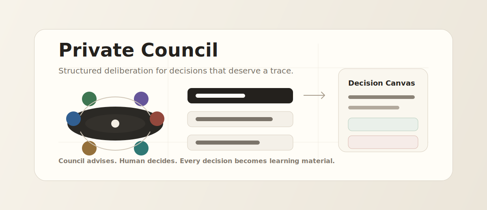
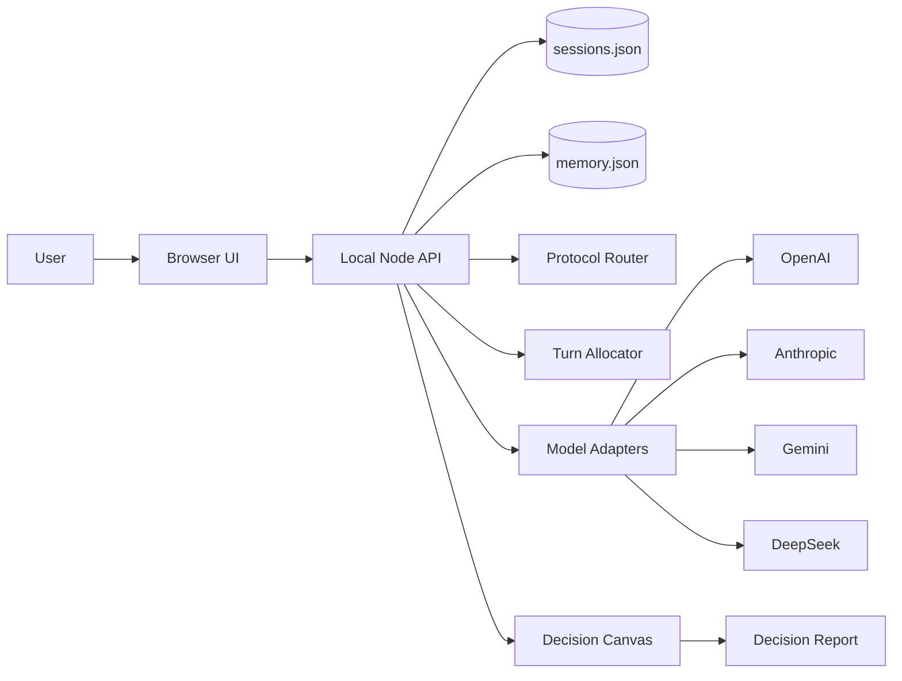

<p align="center">
  
</p>

<h1 align="center">Private Council</h1>

<p align="center">
  <strong>A private AI council for your hardest decisions.</strong>
</p>

<p align="center">
  Structured deliberation · Traceable decision records · Future retrospectives
</p>

<p align="center">
  
  
  
  
</p>

Private Council is not a multi-agent chat demo. It is a local-first decision session system: a fixed council of roles helps frame a hard decision, preserve disagreement, update a Decision Canvas, record the human decision, and schedule a future retrospective.

## Why This Exists

Hard personal decisions usually do not fail because one answer is missing. They fail because the thinking environment is weak: options are unclear, assumptions stay hidden, risks are vague, emotions are ignored, and no one comes back to review what happened.

Private Council turns a decision into a structured meeting:

```text
Frame the problem
→ collect context
→ get independent council views
→ challenge assumptions
→ evaluate options
→ make a human decision
→ commit to next action
→ review later
```

## Features

- Local full-stack web app
- Server-side session persistence
- Structured decision state machine
- Council roles: Chair, Strategist, Skeptic, Operator, Researcher, User Advocate, Reflector
- OpenAI, Anthropic, Gemini, and DeepSeek adapter layer
- Per-role provider/model routing
- Mock fallback when keys are missing or provider calls fail
- Protocol routing
- Turn allocation
- Cross-validation trigger and manual cross-validation
- Claim aggregation and disagreement panel
- Weighted multi-criteria evaluation
- Prediction records and retrospective scoring
- Reliability profile
- Memory candidates and memory consent
- Local long-term memory retrieval
- Evidence records
- Markdown decision report export
- Basic safety routing for high-risk inputs

## Quick Start

```bash
npm test
npm run dev
```

Open:

```text
http://127.0.0.1:4173/
```

The app runs without API keys in mock mode.

## Configure Models

Copy the example file:

```bash
cp .env.example .env
```

Then add keys as needed:

```bash
COUNCIL_PROVIDER=auto
OPENAI_API_KEY=
ANTHROPIC_API_KEY=
GOOGLE_API_KEY=
DEEPSEEK_API_KEY=
```

Optional per-role routing:

```bash
COUNCIL_PROVIDER_SKEPTIC=anthropic
COUNCIL_MODEL_SKEPTIC=claude-sonnet-4-5
COUNCIL_PROVIDER_RESEARCHER=gemini
COUNCIL_MODEL_RESEARCHER=gemini-2.5-flash
```

API keys are read only by the local Node server and are not sent to the browser.

## Architecture



More detail: [docs/ARCHITECTURE.md](./docs/ARCHITECTURE.md)

## Local Data

Runtime data is stored under:

```text
.private-council-data/
```

This folder is ignored by Git. It contains local sessions and accepted long-term memory.

## Safety Boundary

This is a research/product prototype. It is not for medical, legal, investment, crisis, or other regulated advice. High-risk inputs are routed away from normal council flow by basic rules, not a full safety classifier.

## Project Status

This is a local-first prototype suitable for experimentation and GitHub sharing. It is not production-ready: there is no authentication, cloud database, access control, billing, deployment hardening, or full privacy/security review.

## Commands

```bash
npm test       # run automated tests
npm run dev    # start local server
```

## Roadmap

See [docs/ROADMAP.md](./docs/ROADMAP.md).

