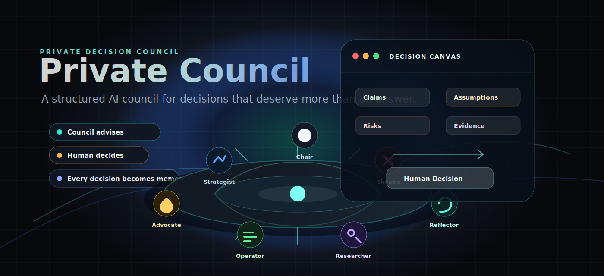
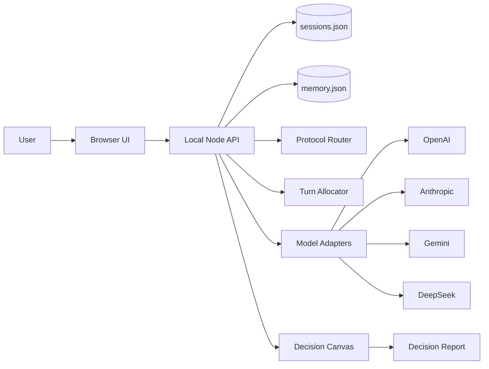

<p align="center">
  
</p>

<h1 align="center">Private Council</h1>

<p align="center">
  <strong>Most AI tools answer questions. Private Council helps you make decisions.</strong>
</p>

<p align="center">
  A local-first AI council for structured deliberation, traceable judgment, and future retrospectives.
</p>

<p align="center">
  
  
  
  
</p>

Private Council is not a multi-agent chat demo. It is a structured decision session system.

It does not just generate advice. It frames the decision, separates roles from models, preserves disagreement, turns arguments into a Decision Canvas, records the human decision, and brings the decision back for review.

## What Makes It Different

### Decision Canvas, not chat history

The conversation is not the product. The product is the evolving decision record: options, criteria, claims, assumptions, risks, evidence, objections, predictions, recommendation, human decision, and review plan.

### Roles are cognitive functions, not model mascots

Chair, Strategist, Skeptic, Operator, Researcher, User Advocate, and Reflector are stable responsibilities. The model behind each role can change through routing.

### Disagreement is preserved before synthesis

Private Council does not rush to consensus. It tracks challenges, minority objections, fragile assumptions, and cross-validation triggers before producing a recommendation.

### Voting is a signal, not a verdict

Role preferences are not treated as the decision rule. The system surfaces where roles agree, where they disagree, why they disagree, and which objection could overturn the recommendation.

### The human decides

The council advises, challenges, structures, and records. The final decision always belongs to the user.

### Every decision becomes learning material

The system records predictions and supports retrospectives, so a decision can improve future judgment instead of disappearing into chat history.

## When To Use It

Private Council is useful when a decision is too important for a quick answer but too personal for a formal team meeting:

- Should I leave my job, change direction, or stay?
- Should I continue building this product?
- Which project should I prioritize?
- Is my current plan actually executable?
- What should I validate before committing?
- Why did a past decision fail or succeed?
- Which option best fits my values, constraints, and energy?

## Try This Demo Decision

Run the app in mock mode and paste this into the decision question:

```text
Should I quit my job to work on my AI product?
```

Suggested context:

```text
I have a prototype, some savings, and strong motivation, but no paying users yet.
I am excited, but worried about income stability.
```

Then click `Continue` through the session phases. Watch the council produce role-specific views while the Decision Canvas accumulates claims, assumptions, risks, options, predictions, and a review plan.

## How It Works

```text
Frame the problem
→ collect context
→ generate independent council views
→ challenge assumptions
→ evaluate options
→ recommend with objections preserved
→ human decides
→ commit to next action
→ schedule review
→ retrospective and reliability learning
```

## Algorithmic Core

This repository includes first working versions of:

- Protocol Router
- Turn Allocator
- Cross-validation Trigger
- Claim Aggregator
- Evaluation Engine
- Reliability Engine
- Memory Governance
- Evidence and report workflow

Read more:

- [Design Philosophy](./docs/PHILOSOPHY.md)
- [Algorithms](./docs/ALGORITHMS.md)
- [Voting and Aggregation](./docs/VOTING_AND_AGGREGATION.md)
- [Research Foundations](./docs/RESEARCH_FOUNDATIONS.md)

## Features

- Local full-stack web app
- Server-side session persistence
- Structured decision state machine
- Council roles: Chair, Strategist, Skeptic, Operator, Researcher, User Advocate, Reflector
- OpenAI, Anthropic, Gemini, and DeepSeek adapter layer
- Per-role provider/model routing
- Mock fallback when keys are missing or provider calls fail
- Decision Canvas
- Manual and triggered cross-validation
- Weighted multi-criteria evaluation
- Prediction records and retrospective scoring
- Reliability profile
- Memory candidates, consent, and retrieval
- Evidence records
- Markdown decision report export
- Basic safety routing for high-risk inputs

## Quick Start

```bash
npm test
npm run dev
```

Open:

```text
http://127.0.0.1:4173/
```

The app runs without API keys in mock mode.

To force mock mode explicitly:

```bash
COUNCIL_PROVIDER=mock npm run dev
```

## Configure Models

Copy the example file:

```bash
cp .env.example .env
```

Then add keys as needed:

```bash
COUNCIL_PROVIDER=auto
OPENAI_API_KEY=
ANTHROPIC_API_KEY=
GOOGLE_API_KEY=
DEEPSEEK_API_KEY=
```

Optional per-role routing:

```bash
COUNCIL_PROVIDER_SKEPTIC=anthropic
COUNCIL_MODEL_SKEPTIC=claude-sonnet-4-5
COUNCIL_PROVIDER_RESEARCHER=gemini
COUNCIL_MODEL_RESEARCHER=gemini-2.5-flash
```

API keys are read only by the local Node server and are not sent to the browser.

## Architecture



More detail: [docs/ARCHITECTURE.md](./docs/ARCHITECTURE.md)

## Local Data

Runtime data is stored under:

```text
.private-council-data/
```

This folder is ignored by Git. It contains local sessions and accepted long-term memory.

## Safety Boundary

This is a research/product prototype. It is not for medical, legal, investment, crisis, or other regulated advice. High-risk inputs are routed away from normal council flow by basic rules, not a full safety classifier.

## Project Status

This is a local-first prototype suitable for experimentation and GitHub sharing. It is not production-ready: there is no authentication, cloud database, access control, billing, deployment hardening, or full privacy/security review.

## Known Limitations

- No authentication or multi-user permissions
- Local JSON storage only
- No production encryption or audit logging
- No real web search or citation pipeline yet
- Evidence quality is user-provided, not independently verified
- Safety routing is rule-based, not a full safety classifier
- Model calls can incur provider costs when real API keys are configured
- The UI is a prototype, not a polished production application

## Commands

```bash
npm test       # run automated tests
npm run dev    # start local server
```

## Roadmap

See [docs/ROADMAP.md](./docs/ROADMAP.md).

## Contributing

Contributions are welcome for algorithms, UX, documentation, safety boundaries, model adapters, and evaluation tooling.

Start here: [CONTRIBUTING.md](./CONTRIBUTING.md)
